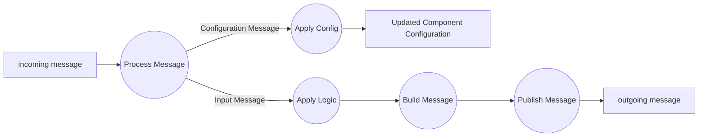
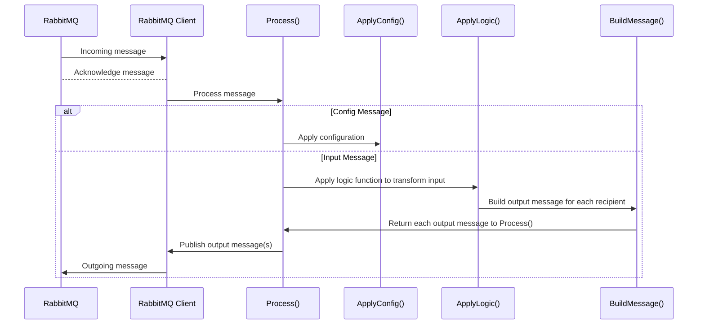

# go-logic
This is the configurable component for dockerized programmable logic device. 

https://hub.docker.com/r/waltermblair/go-logic/

message-passing via RabbitMQ

Data Flow

Sequence Diagram

